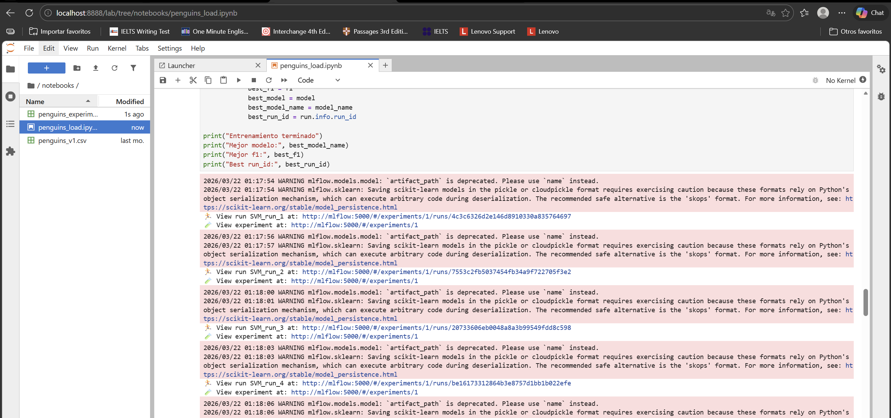
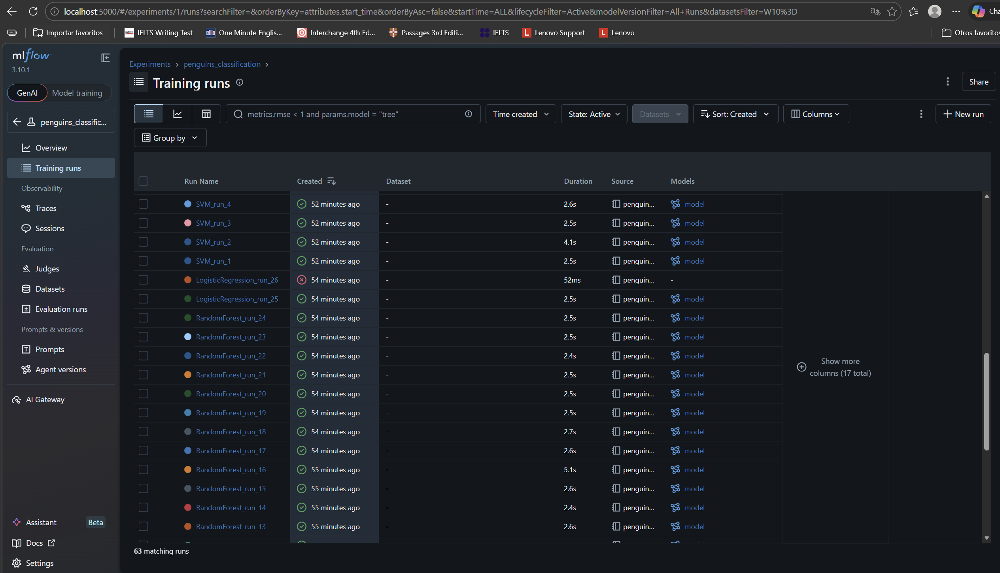
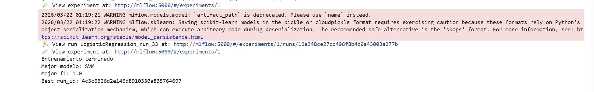
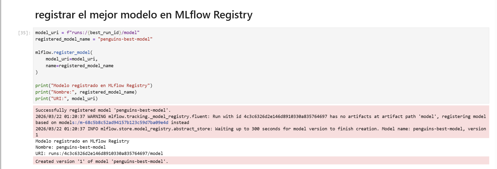
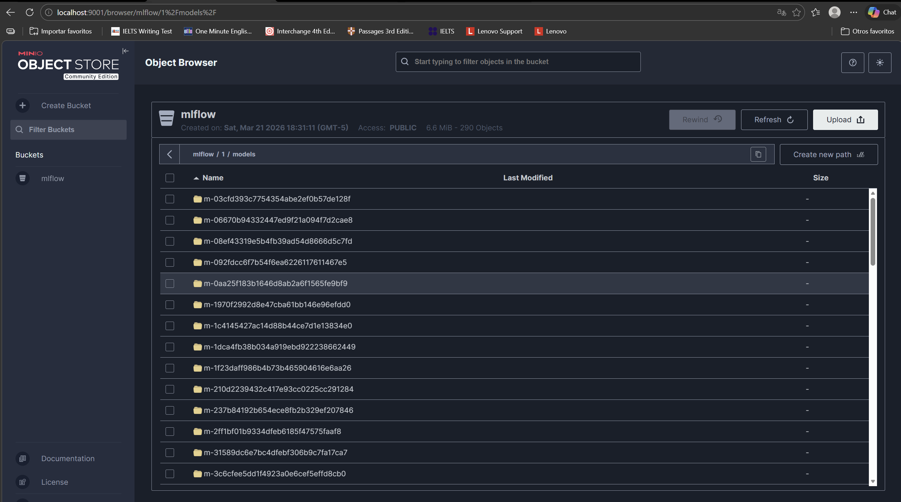
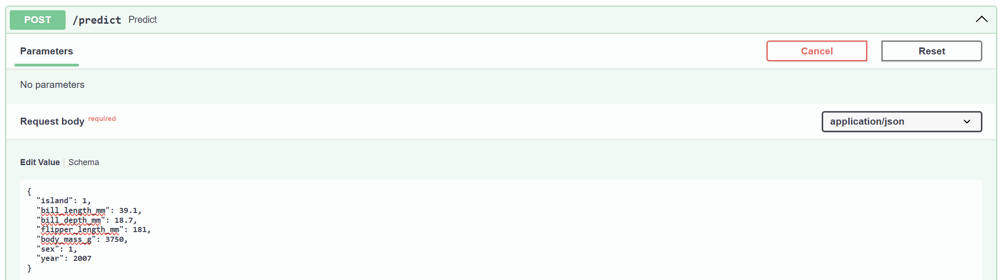
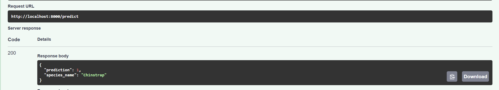
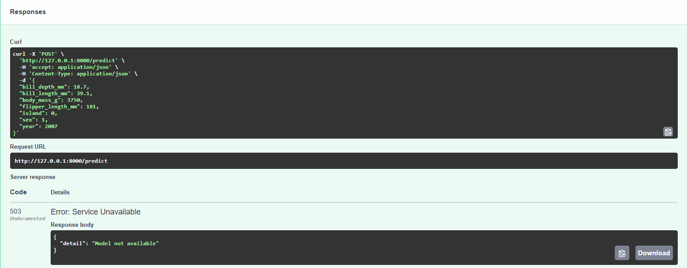

# 🐧 MLOps Penguins Classification - MLFlow

## 📑 Tabla de contenido

- [Arquitectura de la solución](#arquitectura-de-la-solución)
- [Servicios desplegados](#servicios-desplegados)
- [Estructura del proyecto](#estructura-del-proyecto)
- [Variables de entorno](#variables-de-entorno)
- [Levantamiento de la solución](#levantamiento-de-la-solución)
- [Accesos a la solución](#accesos-a-la-solución)
- [Bases de datos utilizadas](#bases-de-datos-utilizadas)
- [Carga y procesamiento de datos](#carga-y-procesamiento-de-datos)
- [Modelos entrenados](#modelos-entrenados)
- [Experimentación en MLflow](#experimentación-en-mlflow)
- [Almacenamiento de artifacts en MinIO](#almacenamiento-de-artifacts-en-minio)
- [API de inferencia](#api-de-inferencia)
- [Colaboradores](#-colaboradores)

## Arquitectura de la solución

La solución está compuesta por los siguientes servicios:

- **PostgreSQL MLflow DB**: almacena la metadata de MLflow
- **PostgreSQL Penguins DB**: almacena los datos `raw` y `processed`
- **MLflow Tracking Server**: registra experimentos, métricas, parámetros y modelos
- **MinIO**: almacena artifacts y modelos generados por MLflow
- **JupyterLab**: ambiente de experimentación y entrenamiento
- **FastAPI**: API de inferencia que carga el mejor modelo desde MLflow Registry

<p align="center">
  
</p>
---

## Servicios desplegados

| Servicio | Propósito | Puerto |
|----------|-----------|--------|
| `mlflow_db` | Base de datos de metadata de MLflow | `5433` |
| `penguins_db` | Base de datos de datos raw y processed | `5434` |
| `minio` | Artifact store para MLflow | `9000` |
| `minio console` | Consola web de MinIO | `9001` |
| `mlflow` | Tracking server y model registry | `5000` |
| `jupyter` | Notebook de experimentación | `8888` |
| `api` | API de inferencia | `8000` |

---

## Estructura del proyecto

```bash
mlops_penguins/
├── .env
├── docker-compose.yml
├── init_sql/
│   └── penguins_init.sql
├── jupyter/
│   ├── Dockerfile
│   └── requirements.txt
├── mlflow/
│   ├── Dockerfile
│   └── requirements.txt
├── api/
│   ├── Dockerfile
│   ├── requirements.txt
│   └── app.py
└── notebooks/
    ├── penguins_v1.csv
    ├── penguins_load.ipynb
    └── penguins_experiment_results.csv
```
---

## Variables de entorno

```bash
MLFLOW_DB_USER=mlflow
MLFLOW_DB_PASSWORD=mlflow123
MLFLOW_DB_NAME=mlflow_db
MLFLOW_DB_PORT=5433

DATA_DB_USER=penguins
DATA_DB_PASSWORD=penguins123
DATA_DB_NAME=penguins_db
DATA_DB_PORT=5434

MINIO_ROOT_USER=minio
MINIO_ROOT_PASSWORD=minio123
MINIO_PORT=9000
MINIO_CONSOLE_PORT=9001
MLFLOW_BUCKET=mlflow

MLFLOW_PORT=5000
JUPYTER_PORT=8888
API_PORT=8000

```
---

## Requisitos previos

- [Docker](https://docs.docker.com/get-docker/) y [Docker Compose](https://docs.docker.com/compose/install/)

---

## Levantamiento de la solución

```bash
docker compose up -d --build
```
<p align="center">
  
</p>
    
---

## Accesos a la solución
MLflow UI:
```bash
http://localhost:5000
```
MinIO Console:
```bash
http://localhost:9001
```
JupyterLab:
```bash
http://localhost:8888
```
FastAPI Docs:
```bash
http://localhost:8000/docs
```
---

## Bases de datos utilizadas
1. Base de datos para metadata de MLflow
    Se usa una instancia dedicada de PostgreSQL para almacenar:
   
        -experimentos
        -runs
        -parámetros
        -métricas
        -registro de modelos
3. Base de datos para datos del proyecto

    Se usa otra instancia de PostgreSQL para almacenar:
   
        -penguins_raw
        -penguins_processed
---

## Carga y procesamiento de datos

Tabla penguins_raw

- Contiene el dataset original cargado desde CSV.

Tabla penguins_processed

- Contiene el dataset listo para modelado:

    - sin columna id
    - sin nulos
    - con variables numéricas listas para entrenamiento
---

# Modelos entrenados
Se entrenaron mínimo tres modelos de clasificación:

- SVM
- RandomForestClassifier
- LogisticRegression
---

## Experimentación en MLflow

- Hiperparámetros explorados
    - **SVM**: `C`, `kernel`, `gamma`
    - **RandomForest**: `n_estimators`, `max_depth`
    - **LogisticRegression**: `C`, `solver`, `max_iter`

Cada ejecución registró en MLflow:

- nombre del modelo
- hiperparámetros
- accuracy
- precision
- recall
- f1_score
- modelo entrenado como artifact

<p align="center">
  
</p>
    
<p align="center">
  
</p>

con esto se registra el mejor modelo en:
```bash
    penguins-best-model
```
<p align="center">
  
</p>

Registro del modelo desde Jupyter hacia MLflow:

<p align="center">
  
</p>

Resultados de los experimentos ordenados en el notebook:

<p align="center">
  
</p>

---

## Almacenamiento de artifacts en MinIO

MLflow usa MinIO como artifact store para guardar:

- Modelos entrenados
- Artifacts de experimentación
- Archivos asociados a los runs
<p align="center">
  
</p>

---

## API de inferencia

La API carga el modelo de forma lazy en cada request. Si el modelo no está disponible en MLflow, la API inicia igual y responde con HTTP 503 en `/predict`.

### Endpoints

| Método | Ruta | Descripción |
|--------|------|-------------|
| `GET` | `/health` | Estado de la API y disponibilidad del modelo |
| `POST` | `/predict` | Predicción de especie |

### Validación de entrada

Cada campo tiene valores por defecto y validación de rangos. Si un valor está fuera del intervalo permitido, la API retorna HTTP 422.

| Campo | Tipo | Rango | Default | Descripción |
|-------|------|-------|---------|-------------|
| `island` | int | 0–2 | 0 | Isla (0=Biscoe, 1=Dream, 2=Torgersen) |
| `bill_length_mm` | float | 30.0–60.0 | 43.9 | Largo del pico en mm |
| `bill_depth_mm` | float | 13.0–22.0 | 17.2 | Profundidad del pico en mm |
| `flipper_length_mm` | int | 170–230 | 200 | Largo de aleta en mm |
| `body_mass_g` | int | 2700–6300 | 4200 | Masa corporal en g |
| `sex` | int | 0–1 | 0 | Sexo (0=hembra, 1=macho) |
| `year` | int | 2007–2009 | 2008 | Año de observación |

### Ejemplo de request

```json
{
  "island": 1,
  "bill_length_mm": 39.1,
  "bill_depth_mm": 18.7,
  "flipper_length_mm": 181,
  "body_mass_g": 3750,
  "sex": 1,
  "year": 2007
}
```

<p align="center">
  
</p>

### Ejemplo de respuesta (modelo disponible)

```json
{
  "prediction": 0,
  "species_name": "Adelie"
}
```

<p align="center">
  
</p>

### Respuesta con modelo no disponible (HTTP 503)

```json
{
  "detail": "Model not available"
}
```
---

<p align="center">
  
</p>

---

## 👥 Colaboradores

- 🧑‍💻 **Camilo Cortés** — [](https://github.com/cccortesh95)
- 🧑‍💻 **Johnny Castañeda** — [](https://github.com/Johnny-Castaneda-Marin)
