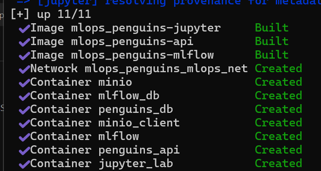

# 🐧 MLOps Penguins Classification - MLFlow

## 📑 Tabla de contenido

- [Arquitectura de la solución](#arquitectura-de-la-solución)
- [Servicios desplegados](#servicios-desplegados)
- [Estructura del proyecto](#estructura-del-proyecto)
- [Variables de entorno](#variables-de-entorno)
- [Requisitos previos](#requisitos-previos)
- [Levantamiento de la solución](#levantamiento-de-la-solución)
- [Metodología de prueba](#metodología-de-prueba)
- [Experimento 1](#experimento-1)
- [Experimento 2](#experimento-2)
- [Experimento 3](#experimento-3)
- [Comparación general de resultados](#comparación-general-de-resultados)
- [Hallazgos principales](#hallazgos-principales)
- [Conclusiones](#conclusiones)
- [Respuesta a las preguntas del taller](#respuesta-a-las-preguntas-del-taller)
- [Colaboradores](#-colaboradores)

## Arquitectura de la solución

La solución está compuesta por los siguientes servicios:

- **PostgreSQL MLflow DB**: almacena la metadata de MLflow
- **PostgreSQL Penguins DB**: almacena los datos `raw` y `processed`
- **MLflow Tracking Server**: registra experimentos, métricas, parámetros y modelos
- **MinIO**: almacena artifacts y modelos generados por MLflow
- **JupyterLab**: ambiente de experimentación y entrenamiento
- **FastAPI**: API de inferencia que carga el mejor modelo desde MLflow Registry

<p align="center">
  
</p>
---

## Servicios desplegados

| Servicio | Propósito | Puerto |
|----------|-----------|--------|
| `mlflow_db` | Base de datos de metadata de MLflow | `5433` |
| `penguins_db` | Base de datos de datos raw y processed | `5434` |
| `minio` | Artifact store para MLflow | `9000` |
| `minio console` | Consola web de MinIO | `9001` |
| `mlflow` | Tracking server y model registry | `5000` |
| `jupyter` | Notebook de experimentación | `8888` |
| `api` | API de inferencia | `8000` |

---

## Estructura del proyecto

```bash
mlops_penguins/
├── .env
├── docker-compose.yml
├── init_sql/
│   └── penguins_init.sql
├── jupyter/
│   ├── Dockerfile
│   └── requirements.txt
├── mlflow/
│   ├── Dockerfile
│   └── requirements.txt
├── api/
│   ├── Dockerfile
│   ├── requirements.txt
│   └── app.py
└── notebooks/
    ├── penguins_v1.csv
    ├── penguins_load.ipynb
    └── penguins_experiment_results.csv
```
---

## Variables de entorno

```bash
MLFLOW_DB_USER=mlflow
MLFLOW_DB_PASSWORD=mlflow123
MLFLOW_DB_NAME=mlflow_db
MLFLOW_DB_PORT=5433

DATA_DB_USER=penguins
DATA_DB_PASSWORD=penguins123
DATA_DB_NAME=penguins_db
DATA_DB_PORT=5434

MINIO_ROOT_USER=minio
MINIO_ROOT_PASSWORD=minio123
MINIO_PORT=9000
MINIO_CONSOLE_PORT=9001
MLFLOW_BUCKET=mlflow

MLFLOW_PORT=5000
JUPYTER_PORT=8888
API_PORT=8000

```
---

## Requisitos previos

- [Docker](https://docs.docker.com/get-docker/) y [Docker Compose](https://docs.docker.com/compose/install/)

---

## Levantamiento de la solución

```bash
docker compose up -d --build
```
<p align="center">
  
</p>
    
---

## Metodología de prueba

Las pruebas se realizaron sobre la API de inferencia desplegada en Docker Compose y consumida mediante Locust desde la misma red interna del proyecto.

Se evaluaron tres escenarios:

1. **Una sola réplica con 0.5 CPU y 512 MB**
2. **Una sola réplica con recursos más restringidos**
3. **Dos réplicas con 0.5 CPU y 512 MB por réplica**

Las métricas observadas fueron:

- **RPS**: Requests por segundo
- **p95 ms**: tiempo de respuesta del percentil 95
- **Errores %**: porcentaje de errores observados
- **Resultado**: estado general del sistema bajo esa carga

---

## Experimento 1

**Configuración**
- 1 réplica
- 0.5 CPU / 512 MB
- carga en bloques de 500 usuarios

| Usuarios | Réplicas API | CPU límite | Memoria límite | RPS | p95 ms | Errores % | Resultado |
|---:|---:|---:|---:|---:|---:|---:|---|
| 500  | 1 | 0.5 | 512M | 12.9 | 37000 | 0 | estable |
| 1000 | 1 | 0.5 | 512M | 0 | 0 | 0 | saturado |

### Análisis del experimento 1

Con una sola réplica y recursos moderados, la API logró atender una carga de **500 usuarios** de forma estable, alcanzando **12.9 RPS**, aunque con una latencia p95 elevada de **37 segundos**.

Al incrementar la carga a **1000 usuarios**, el servicio entró en saturación. En este punto la API dejó de responder de manera útil, lo que indica que una sola instancia con esta configuración no es suficiente para soportar esa carga.

---

## Experimento 2

**Configuración**
- 1 réplica
- 0.25 CPU / 256 MB
- carga en bloques de 10 usuarios

> **Nota:** en la tabla original registrada, los valores consignados en CPU y memoria aparecen como `0.5` y `512M`. Si este escenario corresponde realmente a `0.25 CPU / 256 MB`, se recomienda corregir esos valores en la tabla final del informe.

| Usuarios | Réplicas API | CPU límite | Memoria límite | RPS | p95 ms | Errores % | Resultado |
|---:|---:|---:|---:|---:|---:|---:|---|
| 500  | 1 | 0.5 | 512M | 6.4 | 83000 | 0 | estable |
| 1000 | 1 | 0.5 | 512M | 5.4 | 62000 | 0 | saturado |

### Análisis del experimento 2

Al restringir más los recursos, el sistema mostró un deterioro importante en desempeño. Con **500 usuarios**, la API todavía respondió, pero con apenas **6.4 RPS** y una latencia p95 extremadamente alta de **83 segundos**, lo que evidencia una degradación severa del servicio.

Con **1000 usuarios**, el sistema volvió a saturarse. Este experimento demuestra que reducir demasiado CPU y memoria sí impacta negativamente la capacidad de respuesta, incluso antes de que aparezcan errores explícitos.

---

## Experimento 3

**Configuración**
- 2 réplicas
- 0.5 CPU / 512 MB por réplica
- carga en bloques de 10 usuarios

| Usuarios | Réplicas API | CPU límite | Memoria límite | RPS | p95 ms | Errores % | Resultado |
|---:|---:|---:|---:|---:|---:|---:|---|
| 500  | 2 | 0.5 | 512M | 25.0 | 18000 | 0 | estable |
| 1000 | 2 | 0.5 | 512M | 25.3 | 35000 | 0 | estable |
| 5000 | 2 | 0.5 | 512M | 54.9 | 50000 | 0 | saturado |

en el tercer punto se rompio a 2140

### Análisis del experimento 3

Al pasar de **1 a 2 réplicas**, se observó una mejora clara en la capacidad del sistema:

- a **500 usuarios**, el RPS subió de **12.9** a **25.0**
- a **1000 usuarios**, el sistema se mantuvo estable, cosa que no ocurrió con una sola réplica
- el servicio logró escalar hasta **5000 usuarios**, aunque en ese punto ya se consideró saturado

Esto muestra que la replicación sí mejora la capacidad total del servicio, ya que permite distribuir la carga entre múltiples instancias de la API.

---

## Comparación general de resultados

| Escenario | Capacidad observada | Comentario |
|---|---|---|
| 1 réplica - 0.5 CPU / 512 MB | estable hasta 500 usuarios | se satura al llegar a 1000 |
| 1 réplica - recursos más restringidos | desempeño degradado desde 500 usuarios | menor RPS y mayor latencia |
| 2 réplicas - 0.5 CPU / 512 MB c/u | estable hasta 1000 usuarios | soporta mucha más carga total |

---

## Hallazgos principales

### 1. Reducir recursos demasiado degrada fuertemente la API
Cuando se disminuyeron los recursos de CPU y memoria, la API siguió respondiendo, pero con una latencia muy alta y menor throughput. Esto indica que sí existe un umbral mínimo de recursos por debajo del cual el servicio deja de ser útil, aunque todavía no reporte errores.

### 2. Una sola instancia alcanza rápidamente su punto de saturación
Con una única réplica, la API pudo atender carga moderada, pero no soportó incrementos fuertes de usuarios concurrentes. El servicio se saturó rápidamente a partir de 1000 usuarios.

### 3. Dos réplicas mejoran notablemente el rendimiento
La duplicación del número de instancias permitió incrementar el RPS y mantener estabilidad bajo una mayor cantidad de usuarios concurrentes. Esto confirma que la replicación ayuda a repartir la carga y mejora la capacidad global del sistema.

### 4. No fue posible alcanzar 10.000 usuarios en este entorno
En el entorno de prueba no fue posible sostener 10.000 usuarios concurrentes. La mayor carga observada antes de saturación significativa fue de **2140 usuarios con 2 réplicas**, alcanzando **54.9 RPS**.

---

## Conclusiones

A partir de las pruebas realizadas, se concluye que:

- una sola réplica con **0.5 CPU y 512 MB** soporta una carga limitada y se satura rápidamente,
- reducir más los recursos empeora el desempeño de forma importante,
- escalar a múltiples réplicas mejora el throughput y retrasa el punto de saturación,
- sin embargo, incluso con 2 réplicas, el sistema sigue teniendo un límite claro bajo cargas masivas.

En este caso, la mejor configuración observada fue:

- **2 réplicas**
- **0.5 CPU / 512 MB por réplica**

Esta configuración permitió soportar una cantidad de usuarios considerablemente mayor que los escenarios de una sola instancia.

---

## Respuesta a las preguntas del taller

### ¿Es posible reducir más los recursos?
Sí, pero solo hasta cierto punto. Cuando los recursos bajan demasiado, la API sigue funcionando técnicamente, pero con latencias muy altas y un throughput muy bajo. Por lo tanto, no conviene seguir reduciendo recursos si eso compromete la utilidad del servicio.

### ¿Cuál es la mayor cantidad de peticiones soportadas?
La mayor carga soportada observada en estas pruebas fue de **5000 usuarios** con **2 réplicas**, alcanzando **54.9 RPS**, antes de entrar en saturación.

### ¿Qué diferencia hay entre una o múltiples instancias?
La principal diferencia es la capacidad de distribuir la carga. Con una sola instancia, el servicio se satura más rápido. Con múltiples instancias, aumenta el throughput total y mejora la estabilidad frente a un mayor número de usuarios concurrentes.

### Si no se logra llegar a 10.000 usuarios, ¿cuál fue la cantidad máxima alcanzada?
No fue posible llegar a 10.000 usuarios concurrentes en el entorno de prueba. La cantidad máxima alcanzada antes de saturación fue de **se rompio a 2140 usuarios con 2 réplicas**.


## 👥 Colaboradores

- 🧑‍💻 **Camilo Cortés** — [](https://github.com/cccortesh95)
- 🧑‍💻 **Johnny Castañeda** — [](https://github.com/Johnny-Castaneda-Marin)
